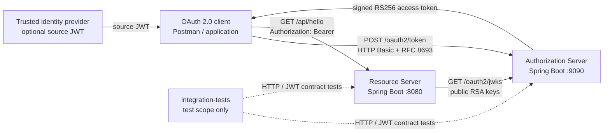

# Portage CyberTech OAuth 2.0 microservices


> **Organization:** Portage Cybertech · **Project:** Mini OAuth 2.0 platform  
> **Author:** Sylvose Allogo · **Email:** sylvose.allogo@yahoo.com · **Version:** 1.0.0 · **Date:** 2026-10-05  
> **Purpose:** Portage CyberTech OAuth 2.0 microservices.


This Java/Spring Boot project, **Authorization and Resource Server Contract
Tests**, contains two independently deployable services and a test-only
integration module. It implements the mini OAuth 2.0 platform described in the
technical-challenge PDF under [`documents`](documents/).

## System at a glance



The Resource Server verifies JWT signatures and claims against the configured
public JWKS, issuer, audience, expiry and `api.read` scope. It does not call an
introspection endpoint for every API request. The production service modules
do not depend on one another in Java/Maven; the integration-test module
depends on them exclusively for tests.

## Repository modules

| Path | Responsibility |
|---|---|
| `authorization-server/` | OAuth 2.0 token endpoint, confidential-client authentication, RFC 8693 token exchange, RS256 token issuance and public JWKS |
| `resource-server/` | Bearer-protected `GET /api/hello`, local JWT validation and health endpoint |
| `integration-tests/` | Cross-service HTTP/JWKS contract tests and Cucumber scenarios; service dependencies are test-scoped |
| `documents/rapports/03_Conception/Diagrammes-PlantUML/` | PlantUML context, component, deployment, class and sequence views |
| `documents/rapports/02_Architecture/` | Bilingual architecture reports and editable source models |
| `documents/rapports/04_Tests-et-Validation/Postman/` | Postman collection, local environments and runner |
| `documents/rapports/04_Tests-et-Validation/Rapports-historiques/` | Historical HTML/JUnit reports and test-operation guidance |

The authoritative API contracts are the service-specific OpenAPI files:
[`Authorization Server`](authorization-server/src/main/resources/static/openapi-authorization.yaml)
and
[`Resource Server`](resource-server/src/main/resources/static/openapi-resource.yaml).
Each service also ships a copy under `src/main/resources/docs/`.

## Requirements

- JDK 23 (the version declared by the project POM).
- Maven 3.9 or newer.
- A Windows, macOS or Linux shell suitable for the commands below.

The repository's older reports may describe an earlier JDK or test run. Read
their execution date and scope before treating those reports as current test
results.

## Build and test

From the repository root:

```powershell
mvn -pl authorization-server package
mvn -pl resource-server package
mvn test
```

The first two commands build each deployable Spring Boot service on its own.
`mvn test` runs the reactor's unit, service-contract and cross-service tests.
The integration module starts both services and sends real HTTP requests to
the configured local test ports. Test code/configuration must not be confused
with a production deployment or production readiness assessment.

## Run the services locally

Open separate terminals from the repository root. The following commands use
the documented local-demo subject grant to obtain a source JWT. This grant
accepts a caller-supplied subject and does **not** authenticate a real user.
Use it only on an isolated developer machine.

Authorization Server:

```powershell
$env:SERVER_PORT = "9090"
$env:OAUTH_ISSUER = "http://localhost:9090"
$env:OAUTH_API_AUDIENCE = "http://localhost:8080/api"
$env:OAUTH_ALLOWED_AUDIENCES = "http://localhost:8080/api"
$env:OAUTH_CLIENT_ID = "agent-client"
$env:OAUTH_CLIENT_SECRET = "local-dev-client-secret-change-me"
$env:OAUTH_SUBJECT_GRANT_ENABLED = "true"
mvn -pl authorization-server spring-boot:run
```

Resource Server:

```powershell
$env:SERVER_PORT = "8080"
$env:OAUTH_ISSUER = "http://localhost:9090"
$env:OAUTH_API_AUDIENCE = "http://localhost:8080/api"
$env:OAUTH_JWKS_URI = "http://localhost:9090/oauth2/jwks"
mvn -pl resource-server spring-boot:run
```

The Postman collection already executes both token requests in order, including
client Basic authentication and the follow-up protected request. To call the
API directly from Windows PowerShell 5, the sample below adds a portable
Basic-auth header rather than using the newer PowerShell 7 `-Authentication`
parameter:

```powershell
$credentialBytes = [System.Text.Encoding]::ASCII.GetBytes(
  "$($env:OAUTH_CLIENT_ID):$($env:OAUTH_CLIENT_SECRET)")
$basic = [Convert]::ToBase64String($credentialBytes)
$headers = @{ Authorization = "Basic $basic" }

$sourceForm = "grant_type=urn%3Aportagecybertech%3Aoauth%3Agrant-type%3Asubject&subject=local-demo-user&scope=api.read"
$source = Invoke-RestMethod -Method Post `
  -Uri "http://localhost:9090/oauth2/token" `
  -Headers $headers -ContentType "application/x-www-form-urlencoded" `
  -Body $sourceForm

$sourceToken = [Uri]::EscapeDataString($source.access_token)
$exchangeForm = "grant_type=urn%3Aietf%3Aparams%3Aoauth%3Agrant-type%3Atoken-exchange&subject_token=$sourceToken&subject_token_type=urn%3Aietf%3Aparams%3Aoauth%3Atoken-type%3Aaccess_token&requested_token_type=urn%3Aietf%3Aparams%3Aoauth%3Atoken-type%3Aaccess_token&audience=http%3A%2F%2Flocalhost%3A8080%2Fapi&scope=api.read"
$access = Invoke-RestMethod -Method Post `
  -Uri "http://localhost:9090/oauth2/token" `
  -Headers $headers -ContentType "application/x-www-form-urlencoded" `
  -Body $exchangeForm

Invoke-RestMethod -Uri "http://localhost:8080/api/hello" `
  -Headers @{ Authorization = "Bearer $($access.access_token)" }
```

Expected local endpoints:

| Request | Expected result |
|---|---|
| `GET http://localhost:9090/actuator/health` | HTTP 200 when the Authorization Server is healthy |
| `GET http://localhost:9090/oauth2/jwks` | HTTP 200 and an RSA public JWK set; never a private signing key |
| `GET http://localhost:8080/actuator/health` | HTTP 200 when the Resource Server is healthy |
| `GET http://localhost:8080/api/hello` with the exchanged Bearer token | HTTP 200 and the authenticated JWT subject in the greeting |
| `GET /api/hello` without a valid JWT | HTTP 401 |
| `GET /api/hello` with a valid JWT that lacks `api.read` | HTTP 403 |

The issued JWT expires after five minutes. Use the endpoints' exact configured
issuer and audience values in both services.

## OAuth 2.0 and JWT contracts

| Contract | Authorization Server | Resource Server |
|---|---|---|
| Issue/exchange token | `POST /oauth2/token`, HTTP Basic confidential client, form-encoded grant parameters | No token endpoint |
| Verify source token | RFC 8693 source JWT signature, issuer, expiry, audience and scopes; restrict output audiences and client-authorized scopes | No token-exchange responsibility |
| Publish/consume keys | `GET /oauth2/jwks` publishes public RSA signing material only | Fetches public JWKS over HTTP from `OAUTH_JWKS_URI` |
| Protected resource | No application-resource route | `GET /api/hello`; requires a valid JWT and `api.read` |
| Health | `GET /actuator/health` | `GET /actuator/health` |
| OAuth failures | `invalid_client` uses HTTP 401; invalid grant/request/scope use OAuth error responses, normally HTTP 400 | Invalid/missing token: HTTP 401; valid token lacking authority: HTTP 403 |

### Demonstration-grant security boundary

`authorization-server/src/main/resources/application.properties` currently
sets `OAUTH_SUBJECT_GRANT_ENABLED` to `true` when the environment variable is
absent. **Override it explicitly to `false` in every shared, integration,
staging or production environment.** Set it to `true` only for isolated local
demonstrations; the supplied subject is not authenticated. The checked-in
`local-dev-client-secret-change-me` is also a known development credential:
replace it with an injected secret before sharing or deploying a service.

The source-token replacement/additional-public-key options exercise limited
source-token verification scenarios. They do not, on their own, implement
complete signing-key rotation, JWKS rollover, persistent key storage or
automated key lifecycle management.

## Configuration reference

| Environment variable | Service | Default in application configuration | Purpose |
|---|---|---|---|
| `SERVER_PORT` | Both | `9090` / `8080` | HTTP listening port |
| `OAUTH_ISSUER` | Both | Authorization: `http://localhost:9090` | Issuer written to/required by access JWTs |
| `OAUTH_API_AUDIENCE` | Both | `http://localhost:8080/api` | Required API audience |
| `OAUTH_JWKS_URI` | Resource Server | `http://localhost:9090/oauth2/jwks` | Trusted Authorization Server public JWKS URI |
| `OAUTH_CLIENT_ID` | Authorization Server | `agent-client` | Confidential-client identifier |
| `OAUTH_CLIENT_SECRET` | Authorization Server | Known local-demo value in `application.properties` | Client secret; inject securely and replace outside local demos |
| `OAUTH_SUBJECT_GRANT_ENABLED` | Authorization Server | **`true` in the checked-in properties file** | Dangerous local-only caller-supplied-subject grant; force `false` outside isolated demonstrations |
| `OAUTH_SUBJECT_TOKEN_ISSUER` | Authorization Server | `OAUTH_ISSUER` | Expected source-token issuer |
| `OAUTH_SUBJECT_TOKEN_JWKS_URI` | Authorization Server | Blank; local signing key is used for demo tokens | External source-token issuer's trusted JWKS URI |
| `OAUTH_ALLOWED_AUDIENCES` | Authorization Server | `OAUTH_API_AUDIENCE` | Comma-separated allow-list for exchange target audiences |
| `RESOURCE_AUTHORIZATION_PUBLIC_KEY` | Authorization Server | Blank | Optional Base64 X.509 public key for source-token verification |
| `RESOURCE_ADDITIONAL_PUBLIC_KEY` | Authorization Server | Blank | Optional second source-token verification key used in the rotation test |
| `RESOURCE_ADDITIONAL_KEY_ID` | Authorization Server | `rotation-simulated` | Key identifier associated with the additional source-token key |

Secrets and private keys in this teaching/demo setup are not an approved
production credential or a persistent key store. Health-detail exposure,
DEBUG web logging, TLS termination, network policy and operational monitoring
must also be reviewed before deployment outside a controlled local environment.

## Contract-test coverage

The tests cover token issuance and exchange, client/grant/scope/audience
rejection, public-key publication, Resource Server signature and claim
validation, missing/malformed/tampered tokens, required scopes and
cross-service HTTP interoperability. The focused two-service integration
tests are in
[`integration-tests/src/test/java/com/portagecybertech/ca/integration/microservices/MicroservicesTest.java`](integration-tests/src/test/java/com/portagecybertech/ca/integration/microservices/MicroservicesTest.java).
The Gherkin scenarios are in
[`miniPlateformeOAuth.feature`](integration-tests/src/test/resources/features/miniPlateformeOAuth.feature).
Use the most recent Maven output or dated reports; historical reports in
`documents/rapports/04_Tests-et-Validation/Rapports-historiques/` do not
assert that the suite has just been run.

## Postman and detailed architecture

- Import the collection and localhost profiles from
  [`documents/rapports/04_Tests-et-Validation/Postman/`](documents/rapports/04_Tests-et-Validation/Postman/).
- See the Postman instructions in
  [`documents/rapports/04_Tests-et-Validation/Postman/Scripts/README.md`](documents/rapports/04_Tests-et-Validation/Postman/Scripts/README.md).
- See the HTTP-test report in
  [`documents/rapports/04_Tests-et-Validation/Rapports-historiques/README.md`](documents/rapports/04_Tests-et-Validation/Rapports-historiques/README.md).
- Open the complete architecture dossier and requirements specification in
  [`documents/rapports/02_Architecture/`](documents/rapports/02_Architecture/README.md).

The report index, translated deliverables and regeneration scripts are
documented in [`documents/rapports/README.md`](documents/rapports/README.md).

## CI and container deployment

- Build the isolated Authorization Server and Resource Server containers with
  [`deployment/`](deployment/README.md); deployment explicitly disables the
  demonstration subject grant and requires an injected client secret.
- Run the Maven reactor pipeline with the isolated Jenkins/JCasC or Concourse
  configurations in [`ci/`](ci/README.md). Both include cross-service tests;
  neither publishes or deploys artifacts without separately configured
  infrastructure and credentials.
- IntelliJ IDEA run configurations are in [`.run/`](.run/); the Maven reactor
  configuration runs `clean verify`.

The architecture deliverables distinguish implemented behaviour, source-PDF
requirements, demonstration limitations and proposed production controls.
They are design and documentation artifacts, not evidence of external
production deployment or security certification.


## Bilingual Postman endpoint report

The consolidated report brings together the Dev environment and historical results. French and English editions are available in HTML, Word, and PDF: [français](documents/rapports/04_Tests-et-Validation/fr/Rapport-des-tests-Endpoint-Postman-Env-Dev.html), [English](documents/rapports/04_Tests-et-Validation/en/Postman-Endpoint-Test-Report-Dev-Environment.html).