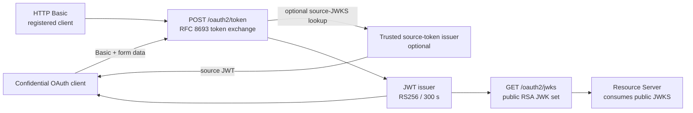

# Authorization Server

> **Organization:** Portage Cybertech · **Project:** Mini OAuth 2.0 platform  
> **Author:** Sylvose Allogo · **Email:** sylvose.allogo@yahoo.com · **Version:** 1.0.0 · **Date:** 2026-10-05  
> **Purpose:** Authorization Server.il:** sylvose.allogo@yahoo.com · **Version:** 1.0.0 · **Date:** 2026-10-04  
> **Purpose:** Authorization Server.


An independently deployable Java/Spring Boot service that authenticates a
confidential OAuth 2.0 client, issues five-minute RS256 JWTs, exchanges
verified source tokens using RFC 8693, and exposes the public verification
keys through JWKS. The Resource Server has no production Java/Maven dependency
on this module.

## Service boundary



## HTTP contracts

| Method and path | Authentication | Contract |
|---|---|---|
| `POST /oauth2/token` | HTTP Basic registered confidential client | Form-encoded RFC 8693 token exchange; the optional local subject grant is deliberately separate and is not an identity assertion |
| `GET /oauth2/jwks` | Public endpoint | Public RSA verification keys; private RSA parameters must never be returned |
| `GET /actuator/health` | Public health probe | Spring Boot health response |
| `GET /swagger-ui.html` | Public API documentation | Interactive view of the Authorization Server OpenAPI contract |

See [`src/main/resources/static/openapi-authorization.yaml`](src/main/resources/static/openapi-authorization.yaml)
for the versioned HTTP and OAuth error contract.

## RFC 8693 token-exchange rules

1. Authenticate the confidential client using HTTP Basic.
2. Require a non-empty `subject_token` and the supported
   `urn:ietf:params:oauth:token-type:access_token` subject-token type. If
   `requested_token_type` is supplied, it must also identify an access token.
3. Validate the source JWT using the configured source-token issuer and either
   the trusted source JWKS URI or the configured/local RSA verification key.
   Reject an invalid signature, issuer, expiration, API audience, or source
   scope as an OAuth error.
4. Allow only scopes authorized for both the client and the source token.
   Restrict the target audience to `OAUTH_ALLOWED_AUDIENCES`.
5. Issue a five-minute RS256 access JWT with the configured `iss`, requested
   `aud`, subject and authorized scopes. Return the token and `issued_token_type`.

Wrong client credentials return HTTP 401 `invalid_client`. Invalid exchange
tokens return HTTP 400 `invalid_grant`; malformed, disallowed-audience,
unauthorized-grant and invalid-scope requests use the OAuth errors documented
in OpenAPI.

## Isolated local demonstration

Run from the repository root in PowerShell:

```powershell
$env:SERVER_PORT = "9090"
$env:OAUTH_ISSUER = "http://localhost:9090"
$env:OAUTH_API_AUDIENCE = "http://localhost:8080/api"
$env:OAUTH_ALLOWED_AUDIENCES = "http://localhost:8080/api"
$env:OAUTH_CLIENT_ID = "agent-client"
$env:OAUTH_CLIENT_SECRET = "local-dev-client-secret-change-me"
$env:OAUTH_SUBJECT_GRANT_ENABLED = "true"
mvn -pl authorization-server spring-boot:run
```

**Security warning:** the current `application.properties` enables the custom
subject grant by default and contains a known local-demo client secret. The
grant signs a caller-supplied subject without authenticating that subject.
Explicitly set `OAUTH_SUBJECT_GRANT_ENABLED=false` and inject a unique secret
in every environment other than an isolated developer demonstration. Do not
use these credentials or grant for a shared, staging or production service.

For a real RFC 8693 source token, configure the trusted external issuer, source
JWKS URI and source/API audience policy. For example:

```powershell
$env:OAUTH_SUBJECT_GRANT_ENABLED = "false"
$env:OAUTH_SUBJECT_TOKEN_ISSUER = "https://identity.example.invalid"
$env:OAUTH_SUBJECT_TOKEN_JWKS_URI = "https://identity.example.invalid/.well-known/jwks.json"
```

Never replace the placeholder example host with an unverified issuer; align
the issuer and JWKS with the actual approved identity provider.

## Configuration

| Variable | Application property | Purpose |
|---|---|---|
| `SERVER_PORT` | `server.port` | HTTP port; local default `9090` |
| `OAUTH_ISSUER` | `app.oauth.issuer` | Configured JWT issuer and discovery issuer |
| `OAUTH_API_AUDIENCE` | `app.oauth.api-audience` | Default/required API audience |
| `OAUTH_ALLOWED_AUDIENCES` | `app.oauth.allowed-audiences` | Comma-separated allow-list for token-exchange output |
| `OAUTH_CLIENT_ID` | `app.oauth.client-id` | Registered confidential OAuth client |
| `OAUTH_CLIENT_SECRET` | `app.oauth.client-secret` | Local-development fallback; inject a unique secret outside isolated demos |
| `OAUTH_SUBJECT_GRANT_ENABLED` | `app.oauth.subject-grant.enabled` | Custom caller-supplied subject grant; **file default is true, shared environments must explicitly set false** |
| `OAUTH_SUBJECT_TOKEN_ISSUER` | `app.oauth.subject-token-issuer` | Expected issuer of RFC 8693 source tokens |
| `OAUTH_SUBJECT_TOKEN_JWKS_URI` | `app.oauth.jwks-uri` | Optional HTTPS JWKS URI for the external source-token issuer |
| `RESOURCE_AUTHORIZATION_PUBLIC_KEY` | `app.oauth.authorization-public-key` | Optional Base64-encoded X.509 RSA source-verification key |
| `RESOURCE_ADDITIONAL_PUBLIC_KEY` | `app.oauth.additional-public-key` | Optional additional source-token validation key used by the rotation simulation |
| `RESOURCE_ADDITIONAL_KEY_ID` | `app.oauth.additional-key-id` | JWT `kid` that selects the additional source-token key |

The client repository, authorization service and dynamically generated signing
key are in memory in the current demo. A restart therefore changes the signing
key. Durable clients, persistent signing material, secure key custody and
overlapping JWKS rotation require a separate production design.

## Build and tests

From the repository root:

```powershell
mvn -pl authorization-server package
mvn -pl authorization-server test
```

Tests exercise the configuration and grant providers, token endpoint and
client errors, HTTP contract, JWK content/public-only guarantee, token
exchange, allowed audiences, scopes, invalid source-token rejection and the
additional source-verification-key scenario. Run `mvn test` at the reactor
root to include Resource Server and test-scope cross-service contracts.

The additional-key unit test demonstrates validation of a JWT signed by an
extra source-token key. It is **not** end-to-end Authorization Server signing
key rotation: the process does not by itself implement durable key rollover,
JWKS overlap or automated key retirement.

For hardened non-demo container deployment, see
[`deployment/README.md`](../deployment/README.md). CI and JCasC/Concourse
configuration are shared at [`ci/README.md`](../ci/README.md).


## Bilingual Postman endpoint report

The consolidated report brings together the Dev environment and historical results. French and English editions are available in HTML, Word, and PDF: [français](../documents/rapports/04_Tests-et-Validation/fr/Rapport-des-tests-Endpoint-Postman-Env-Dev.html), [English](../documents/rapports/04_Tests-et-Validation/en/Postman-Endpoint-Test-Report-Dev-Environment.html).
