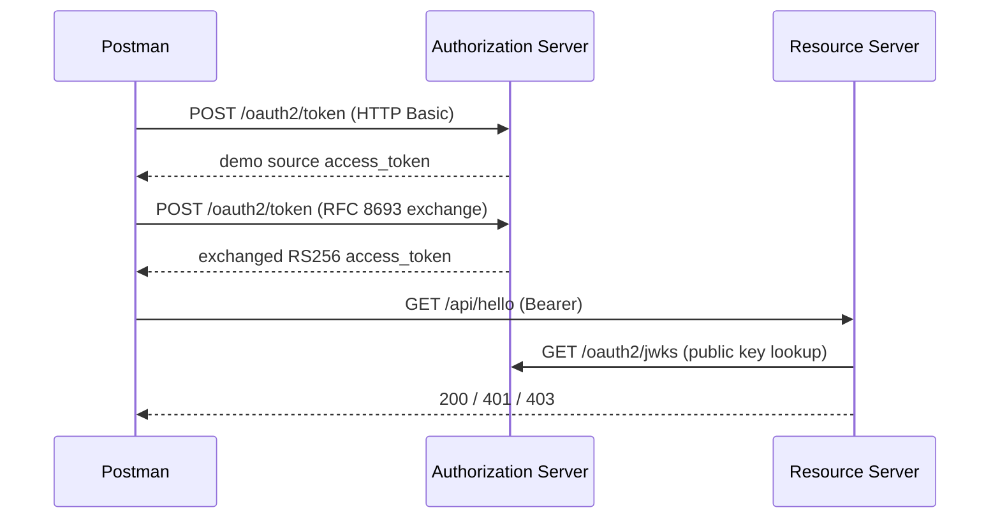

# Postman collection and local contract-test profiles

> **Organization:** Portage Cybertech · **Project:** Mini OAuth 2.0 platform  
> **Author:** Sylvose Allogo · **Email:** sylvose.allogo@yahoo.com · **Version:** 1.0.0 · **Date:** 2026-10-05  
> **Purpose:** Postman collection and local contract-test profiles.· **Version:** 1.0.0 · **Date:** 2026-10-04  
> **Purpose:** Postman collection and local contract-test profiles.


**Project:** Portage CyberTech OAuth 2.0 · **Project version:** 1.0.0  
**Document revision:** 1.1 · **Date:** 2026-10-05  
**Author:** Sylvose Allogo · sylvose.allogo@yahoo.com

This folder contains the Postman collection, localhost environment files
and Windows runner used for the project's OAuth 2.0/JWT demonstration.
Profile names are labels for local simulations, not proof of connectivity to
remote integration or production deployments.

## Files

- `Portage CyberTech - OAuth2 End-to-End.postman_collection.json`: health, JWKS, token issue and
  exchange, protected-resource access, invalid client/source-token and
  unauthorized/tampered Bearer-token requests.
- `environments/Env Dev.postman_environment.json`,
  `Env Int.postman_environment.json` and
  `Env Prod.postman_environment.json`: local URLs and per-profile variables.
- `run-collection.ps1`: executes the selected localhost profile(s) with the
  Postman CLI and writes JUnit XML reports.
- `start-authorization-server.ps1` and `start-resource-server.ps1`: helper
  launchers for the pre-built executable Spring Boot JARs.

The runner and collection use the exact filenames in this folder. Do not copy
credentials between environment exports.

## Local topology



All three checked-in profiles use the same local-demo URLs so they can be run
in one Postman CLI invocation while the default local services remain running:
Authorization Server `9090` and Resource Server `8080`. Profile names `Int`
and `Prod` are legacy local-test labels, not real integration or production
systems. Always align the issuer, target audience and JWKS URL with the
services' runtime configuration before testing another topology.

## Two separate local terminal sessions

From the repository root, start the services with Maven:

```powershell
$env:SERVER_PORT = "9090"
$env:OAUTH_ISSUER = "http://localhost:9090"
$env:OAUTH_API_AUDIENCE = "http://localhost:8080/api"
$env:OAUTH_ALLOWED_AUDIENCES = "http://localhost:8080/api"
$env:OAUTH_CLIENT_ID = "agent-client"
$env:OAUTH_CLIENT_SECRET = "local-dev-client-secret-change-me"
$env:OAUTH_SUBJECT_GRANT_ENABLED = "true"
mvn -pl authorization-server spring-boot:run
```

In a second terminal:

```powershell
$env:SERVER_PORT = "8080"
$env:OAUTH_ISSUER = "http://localhost:9090"
$env:OAUTH_API_AUDIENCE = "http://localhost:8080/api"
$env:OAUTH_JWKS_URI = "http://localhost:9090/oauth2/jwks"
mvn -pl resource-server spring-boot:run
```

The `true` subject-grant setting is for the isolated demo source token only.
The grant signs a subject supplied by the caller and is not user
authentication. Force it to `false` outside a single-user local test, and
never use the repository's known demo secret in a shared environment.

## Running the Postman tests

Import the collection and a local environment in Postman Desktop, select the
environment and run the collection. To use the CLI, install the official
Postman CLI and ensure `postman` is on `PATH`. From this directory, run one
local profile or all three:

```powershell
.\run-collection.ps1 -EnvironmentName All
```

The runner requires both services to be available. It writes uniquely
timestamped JUnit files under
`../../Rapports-historiques/Postman/`, preserving the historical reports
already in that folder. Reports are generated locally and may be sensitive;
do not commit source JWTs, exchanged tokens, passwords or production endpoints.

If a test must use alternate ports or an external identity provider, update a
copied local profile and configure **both** application processes to match its
issuer, audience, JWKS URI and port before running the collection. Never
retarget the checked-in local profiles to production.

## What the collection checks

1. Health endpoints respond successfully.
2. The Authorization Server publishes a usable public RSA JWK Set and does
   not disclose RSA private parameters.
3. The confidential client can obtain a local-demo subject token and exchange
   a valid source token using RFC 8693.
4. The exchanged access token authorizes `GET /api/hello`.
5. Requests without a Bearer token or with a modified token are denied with
   HTTP 401.
6. Invalid client credentials and an invalid source token produce the expected
   OAuth error responses.

Historical JUnit results are in
`../../Rapports-historiques/Postman/postman-Env-*.xml`; consult the
run-date and the documented host/port before treating them as evidence of a
current run. Env Int and Env Prod are localhost-only simulations. Do not
point them at real systems until a deployment owner supplies genuine URLs,
trusted issuer/JWKS/audience and per-environment confidential credentials.

The application contracts expose only GET and POST operations. The
collection must not invent writes or destructive API operations that the
services do not implement.


## Bilingual Postman endpoint report

The consolidated report brings together the Dev environment and historical results. French and English editions are available in HTML, Word, and PDF: [français](../../fr/Rapport-des-tests-Endpoint-Postman-Env-Dev.html), [English](../../en/Postman-Endpoint-Test-Report-Dev-Environment.html).
