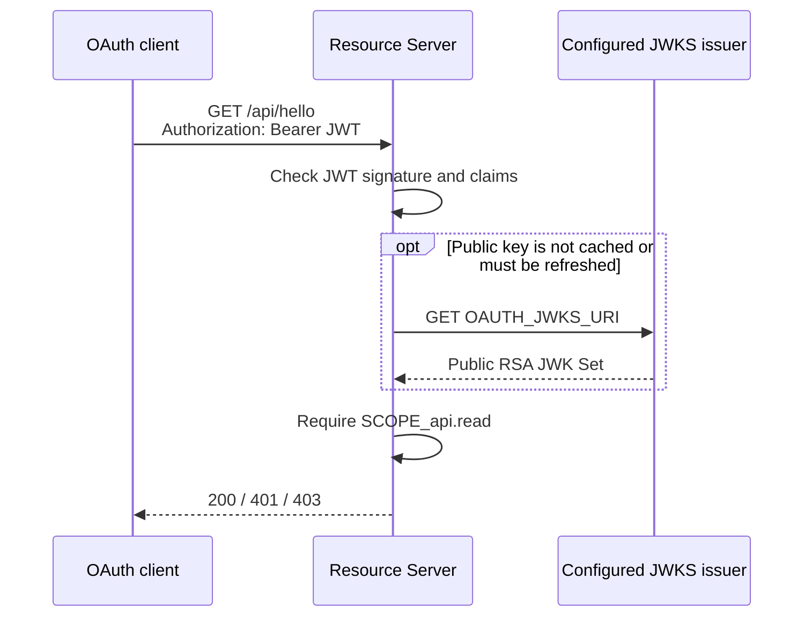

# Resource Server

> **Organization:** Portage Cybertech · **Project:** Mini OAuth 2.0 platform  
> **Author:** Sylvose Allogo · **Email:** sylvose.allogo@yahoo.com · **Version:** 1.0.0 · **Date:** 2026-10-05  
> **Purpose:** Resource Server.**Email:** sylvose.allogo@yahoo.com · **Version:** 1.0.0 · **Date:** 2026-10-04  
> **Purpose:** Resource Server.


An independently deployable Spring Boot API that protects
`GET /api/hello` with Spring Security JWT Bearer authentication. It has no
runtime Java/Maven dependency on the Authorization Server and stores no
OAuth client secret or JWT signing private key.

## Request flow



The configured `JwtDecoder` validates the RS256 signature using the trusted
JWKS, the exact issuer, expiry and required API audience. The API also
requires `SCOPE_api.read`. A rejected request does not reveal whether a
particular signature, issuer or audience check failed.

## HTTP contracts

| Method and path | Authorization | Result |
|---|---|---|
| `GET /api/hello` | Valid Bearer access JWT and `api.read` | HTTP 200 and a greeting containing the validated principal name |
| `GET /actuator/health` | Public health endpoint | HTTP 200 when healthy |
| `GET /swagger-ui.html` | Public API documentation | Interactive view of the Resource Server OpenAPI contract |

An absent, malformed, expired, incorrectly signed, wrong-issuer or wrong-
audience token is rejected with HTTP 401. A valid JWT that lacks `api.read`
is rejected with HTTP 403.

OpenAPI source:
[`src/main/resources/static/openapi-resource.yaml`](src/main/resources/static/openapi-resource.yaml).

## Run locally

From the repository root, start the Resource Server in a separate terminal
after starting the Authorization Server:

```powershell
$env:SERVER_PORT = "8080"
$env:OAUTH_ISSUER = "http://localhost:9090"
$env:OAUTH_API_AUDIENCE = "http://localhost:8080/api"
$env:OAUTH_JWKS_URI = "http://localhost:9090/oauth2/jwks"
mvn -pl resource-server spring-boot:run
```

The API does not obtain access tokens or accept client credentials. Clients
request tokens directly from the trusted OAuth Authorization Server and
present a Bearer access JWT to this service.

## Configuration

| Environment variable | Application property | Local default | Meaning |
|---|---|---|---|
| `SERVER_PORT` | `server.port` | `8080` | HTTP listener port |
| `OAUTH_ISSUER` | `app.oauth.issuer` | `http://localhost:9090` | Exact trusted issuer expected in `iss` |
| `OAUTH_API_AUDIENCE` | `app.oauth.api-audience` | `http://localhost:8080/api` | Audience the JWT must contain |
| `OAUTH_JWKS_URI` | `app.oauth.jwks-uri` | `http://localhost:9090/oauth2/jwks` | Trusted URI for public RSA JWT verification keys |

All service-specific values must agree with the issuer, audience and public
JWKS actually used by the issuer. For remote deployments use approved
HTTPS URLs and a trusted issuer; a working endpoint or valid signature from
an untrusted key source is not sufficient.

## Build and tests

From the repository root:

```powershell
mvn -pl resource-server package
mvn -pl resource-server test
```

The module tests its controller, health endpoint, Bearer/JWT rejection and
acceptance, audience, issuer, expiry and scope, signature tampering, and
validation through a controlled HTTP JWKS test fixture. The cross-service
module additionally verifies interaction with the real Authorization Server
over the documented HTTP/JWKS contract.

There are no `POST`, `PUT`, `PATCH` or `DELETE` resource operations in the
current API. Do not infer authorization or data-persistence behaviour for
operations that are not implemented.

## Postman

The shared collection and local profiles are in
[`documents/rapports/04_Tests-et-Validation/Postman/`](../documents/rapports/04_Tests-et-Validation/Postman/).
The health and protected-resource test requests are documented in
[`Postman test guidance`](../documents/rapports/04_Tests-et-Validation/Postman/Scripts/README.md). All
profiles currently point to local simulations; `Env Int` and `Env Prod` are
labels for repeatable localhost tests, **not** real integration or production
deployments.

For the non-root container deployment and its internal JWKS configuration,
see [`deployment/README.md`](../deployment/README.md). The shared reactor
pipelines are documented in [`ci/README.md`](../ci/README.md).


## Bilingual Postman endpoint report

The consolidated report brings together the Dev environment and historical results. French and English editions are available in HTML, Word, and PDF: [français](../documents/rapports/04_Tests-et-Validation/fr/Rapport-des-tests-Endpoint-Postman-Env-Dev.html), [English](../documents/rapports/04_Tests-et-Validation/en/Postman-Endpoint-Test-Report-Dev-Environment.html).
